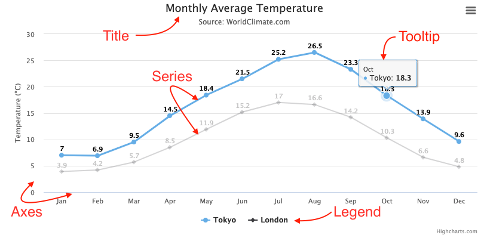

# Highcharts

> [Highcharts 官网](https://www.Highcharts.com/)

## 介绍

Highcharts JS 是一个基于 `SVG` 和一些 `canvas/WebGL` 的 JavaScript 图表库。

## 图表的主要概念

### Title

描述图表的文本。通常位于图表的顶部。

### Series

图表上显示的一个或多个数据序列。

### Tooltip

将鼠标悬停在图表上的序列或点上时，您可以获得描述图表特定部分中的值的工具提示。

### Legend

图例在图表中显示数据系列，并允许您启用和禁用一个或多个系列。

### Axes

大多数图表（如典型的笛卡尔折线图和柱形图）都有两个轴来度量和分类数据：垂直轴（y 轴）和水平轴（x 轴）。3D 图表具有第三个轴，即深度轴（z 轴）。极坐标图（也称为雷达图）只有一个轴，该轴跨越图表的周边。仪表图（也称为速度计图）甚至可以具有单个值轴。但是，饼图没有轴。
